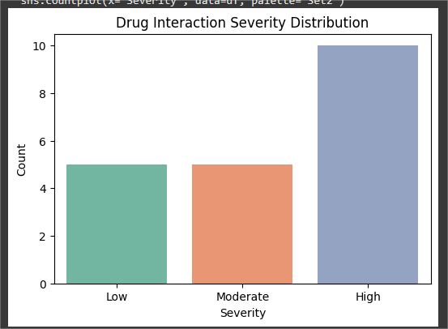
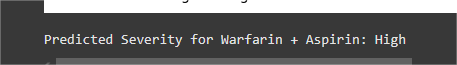

# Drug Interaction Severity Prediction

This file documents the **prompts and instructions** used to build this project step by step with ChatGPT.  
It highlights how **AI-assisted workflows** and **prompt engineering** guided dataset creation, model training, and project documentation.

---

## 1. Dataset Creation
**Prompt:**  
> Create a small synthetic dataset of drug-drug interactions with features: `Drug1`, `Drug2`, `Interaction`, and `Severity` (Low, Moderate, High).  

**Output:**  
- A balanced dataset of ~20 rows.  
- Examples like:  
  - Warfarin + Aspirin → "Increases bleeding risk" → High  
  - Digoxin + Riboflavin → "May reduce absorption" → Moderate  

📸 *CSV preview:*  

---

## 2. Notebook Setup
**Prompt:**  
> Build me a Google Colab notebook where I can manually upload the dataset CSV and run machine learning models. Include train/validation/test split.  

**Output:**  
- Code for **manual file upload** via `files.upload()` in Colab.  
- Data loading and inspection.  
- Train/Validation/Test split with stratification.

---

## 3. Data Exploration
**Prompt:**  
> Add exploratory data analysis (EDA) to check severity distribution, duplicates, and missing values.  

**Output:**  
- Severity distribution plot.  
- Missing value check.  
- Duplicate removal code.

📸 *Sample image of the DI severity distribution (EDA chart):*  

---

## 4. Feature Engineering
**Prompt:**  
> Combine `Drug1`, `Drug2`, and `Interaction` text into a single feature. Use TF-IDF vectorization.  

**Output:**  
- Preprocessing pipeline with TF-IDF.  
- Encoded features ready for ML models.

---

## 5. Model Training
**Prompt:**  
> Train Logistic Regression and Decision Tree classifiers. Evaluate both with validation and test sets.  

**Output:**  
- Training and evaluation code for both models.  
- Accuracy scores, classification reports, confusion matrices.  

📸 *Sample image of decision tree Model results:*  
)

---

## 6. Interactive Demo
**Prompt:**  
> Add a function where I can input two drugs and their interaction to predict severity.  

**Output:**  
- `predict_interaction()` function for real-time demo.  
- Sample predictions like:  
  - Warfarin + Aspirin → High  

📸 *Sample image of prediction (Prediction demo):*  

---

## 🌟 Lessons Learned
- Prompt engineering helped **translate pharmacology knowledge into an ML workflow**.  
- Iterative prompting fixed errors and added clarity.  
- AI assisted in **dataset design, code generation and prediction demo**.  

---
